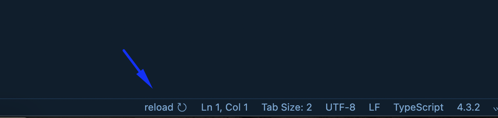

  
  # refresh-window

  
      

It will add an icon in your statusbar to refresh the vscode window

## Features

- Reload / Refresh window

[Download Link](https://marketplace.visualstudio.com/items?itemName=Sifat.refresh-window)
